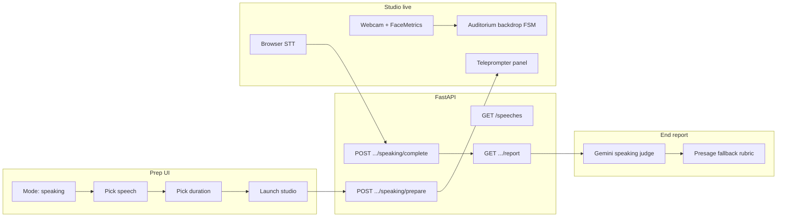

# SpeakUp — Public Speaking mode (implementation plan)

**Goal:** Ship **Public Speaking** as a self-contained practice mode: pick a famous speech, pick a time budget, get a Gemini-curated teleprompter, deliver on an auditorium stage while **audience visuals react only to Presage/face delivery signals** (no spoken audience interaction), then receive an end-of-session **Gemini evaluation** that combines transcript, timing, and delivery telemetry for the Results report.

**Deferred:** Thesis Defense (separate plan after speaking ships).

**Runtime truth:** [handoff.md](handoff.md)  
**Presage / face pipeline:** `use-face-composure.ts` → `use-composure-sampler.ts` (same “Pegasus/Presage” path the salary studio already uses)

---

## Product summary

| User choice | Behavior |
|-------------|----------|
| **Speech** | One of **3 seeded speeches** (3 different historical speakers; excerpts sourced from [HighSpark famous persuasive speeches](https://highspark.co/blogs/famous-persuasive-speeches)) |
| **Duration** | **30s**, **45s**, or **Full length** (count-up; user taps **Finish speech** when done) |
| **Stage** | Auditorium backgrounds only — no recruiter/manager/HR opponent sprite |
| **Teleprompter** | Gemini selects the best lines from the full speech text to fit the chosen duration (or full speech for unlimited) |
| **Delivery** | User speaks until countdown hits zero (timed modes) or until **Finish speech** (full length) |
| **Audience** | Visual reactions driven by **facial/expression metrics**; no `/interject`, no Nemotron director, no Q&A |
| **Report** | Gemini scores delivery + content fit; includes whether they finished in time and how well they covered the teleprompter |

---

## Success criteria (demo-ready)

1. **Prep:** Public Speaking is **unlocked** on Home/Prep; user can complete prep without picking a salary “opponent.”
2. **Catalog:** `GET /speeches` returns exactly **3** speeches with speaker, title, teaser, and estimated full-read duration.
3. **Teleprompter:** After speech + duration are chosen, backend returns **teleprompter lines** within ~5s (Gemini) or deterministic excerpt fallback without a key.
4. **Live studio:** Single delivery segment — teleprompter visible, timer behaves per mode, STT shows live user caption, Presage pane still works.
5. **Auditorium:** Background transitions **empty → full house → (optional reaction plate) → full house** with debounced face-driven reactions.
6. **No dialogue loop:** Zero interviewer TTS, zero `POST /turn` multi-turn loop, zero `useComposureReactions` / `POST /interject` for speaking sessions.
7. **Report:** `/sessions/{id}/report` includes a **speaking-specific rubric** (`source: gemini` when keyed) referencing transcript, teleprompter coverage, timing flags, and aggregated delivery stats.
8. **Zero-key demo:** Full flow completes with mock teleprompter + Presage-heuristic report (same pattern as salary mock interviewer).

---

## Canonical speech seed (v1)

Store **full excerpt text** in SQLite (not fetched at runtime). Attribute source URL in metadata. Suggested three speakers from the HighSpark list (distinct people, strong teleprompter rhythm):

| `slug` | Speaker | Title (display) | HighSpark section |
|--------|---------|-------------------|-------------------|
| `mlk-dream` | Martin Luther King Jr. | I Have a Dream (excerpt) | §1 |
| `elizabeth-tilbury` | Queen Elizabeth I | Speech to the Troops at Tilbury (excerpt) | §2 |
| `sojourner-truth` | Sojourner Truth | Ain’t I a Woman? (excerpt) | §4 |

**Licensing note:** Excerpts are for **educational practice** inside the hackathon demo; keep `source_url` on each row. Do not hotlink or scrape at runtime — one-time seed only.

---

## Architecture overview



**Session model:** One speaking session = **one logical “turn”** in `turns` for compatibility with existing Results plumbing:

- `question` field → teleprompter text (joined lines or JSON string — pick one and document in `settings_json`)
- `answer` field → final STT transcript
- `composure` → session-aggregate from client payload or backend `sample_composure(answer)`
- `settings_json` holds `scenario_id: "speaking"`, `speech_id`, `duration_mode`, `teleprompter_lines`, `delivery_stats`, `finished_in_time`, etc.

Salary / interview paths stay on `_execute_turn` + `interviewer.py`; speaking bypasses that loop.

---

## Phase 0 — Assets & config (0.5 day)

### 0.1 Auditorium images

Expected under `frontend/public/backgrounds/auditorium/` (add files if missing; `stage-backgrounds.ts` already references two):

| File | Use |
|------|-----|
| `aud_empty.png` | Prep / before speech locked |
| `aud_filled.png` | Default “full house” during delivery |
| `aud_react_engaged.png` | High engagement + low stress (optional separate art or CSS tint overlay) |
| `aud_react_tense.png` | High stress / low composure |
| `aud_react_warm.png` | Strong composure + steady eye line |

If only two PNGs exist initially, ship v1 with **crossfade + subtle CSS grade** on `aud_filled` for reactions; add dedicated reaction plates when art is ready.

### 0.2 Frontend config

- `frontend/src/config/modes.ts` — set `speaking.ready: true`
- `frontend/src/config/stage-backgrounds.ts` — replace static speaking URL with **`audienceStageUrl(phase, reaction)`** (new module or extend this file)
- `frontend/src/config/speaking-duration.ts` — **new**: `{ id: '30' | '45' | 'full', seconds: 30 | 45 | 0 }`

---

## Phase 1 — SQLite speech catalog (0.5 day)

### 1.1 Schema (`backend/repository.py`)

Add migration in `init_db()`:

```sql
CREATE TABLE IF NOT EXISTS speeches (
  id TEXT PRIMARY KEY,
  slug TEXT NOT NULL UNIQUE,
  speaker TEXT NOT NULL,
  title TEXT NOT NULL,
  excerpt_text TEXT NOT NULL,
  source_url TEXT NOT NULL,
  word_count INTEGER NOT NULL,
  est_full_duration_sec INTEGER NOT NULL,
  sort_order INTEGER NOT NULL DEFAULT 0,
  created_at TEXT NOT NULL
);
```

### 1.2 Seed script

- **New:** `backend/seed_speeches.py` (idempotent `INSERT OR REPLACE` by `slug`)
- **New:** `backend/data/speeches/*.txt` or inline constants in seed file for the three excerpts
- Run once on deploy / document in README: `python -m seed_speeches` from `backend/`

### 1.3 Repository helpers

- `list_speeches() -> list[dict]`
- `get_speech(speech_id: str) -> dict | None`

### 1.4 API

- `GET /speeches` — public catalog (no auth); returns `{ speeches: [{ id, slug, speaker, title, teaser, word_count, est_full_duration_sec }] }`  
  - `teaser` = first ~160 chars of excerpt (server-side), not full text (full text only after selection + session bind)

**Acceptance:** Fresh DB → seed → `GET /speeches` returns 3 rows.

---

## Phase 2 — Gemini teleprompter (`backend/speaking.py`) (1 day)

### 2.1 Module responsibilities

**New file:** `backend/speaking.py`

| Function | Purpose |
|----------|---------|
| `build_teleprompter(speech, duration_mode)` | Returns `{ lines: string[], target_sec, notes? }` |
| `mock_teleprompter(speech, duration_mode)` | Word-budget heuristic (~2.5 wps) when no `GEMINI_API_KEY` |
| `gemini_teleprompter(...)` | Structured JSON output |

**Gemini system prompt (sketch):**

- Input: full `excerpt_text`, `duration_mode`, `target_sec` (30/45/null for full)
- Output JSON only: `{ "lines": ["...", "..."], "estimated_sec": number, "rationale": "short" }`
- Rules: preserve speaker voice; prefer iconic lines for short modes; for `full`, lines may be the entire excerpt split into ~1–2 sentence chunks; no commentary to the user

**Duration budgets:**

| Mode | `target_sec` | Line budget guidance |
|------|--------------|----------------------|
| 30s | 30 | ~75 words total |
| 45s | 45 | ~110 words total |
| full | `est_full_duration_sec` | All excerpt, chunked for scroll |

### 2.2 Prepare endpoint

`POST /sessions/{session_id}/speaking/prepare`

Body: `{ "speech_id": "...", "duration_mode": "30" | "45" | "full" }`

Steps:

1. Validate session exists and `settings.scenario_id === "speaking"` (or set scenario on create — see Phase 3).
2. Load speech row; call `build_teleprompter`.
3. Persist in `settings_json`:
   - `speech_id`, `speech_title`, `speaker`
   - `duration_mode`, `target_duration_sec`
   - `teleprompter_lines` (array)
   - `teleprompter_prepared_at`
4. Return teleprompter payload to client (lines + metadata).

Wire in `main.py`; add Pydantic models next to existing session bodies.

**Acceptance:** With Gemini key, 30s mode returns ≤~90 words across lines; without key, mock returns stable deterministic slice.

---

## Phase 3 — Prep wizard for speaking (1 day)

### 3.1 Stepper changes (`StudioPrep.tsx`)

When `modeId === 'speaking'`:

| Step | Replace |
|------|---------|
| Scenario | unchanged (speaking card enabled) |
| Opponent | **Pick a speech** — grid from `GET /speeches` |
| Context | **Pick duration** — 30s / 45s / Full length (not salary session length 3–15 min) |
| Ready | Summary: speech title, speaker, duration; **no document upload required** (hide or collapse ContextPanel) |

### 3.2 Session create (`Setup.tsx` → `createSession`)

For speaking:

- `scenarioId: 'speaking'`
- `characterId` — send **`null`** or a sentinel `'audience'` (extend `ALLOWED_CHARACTER_IDS` or make character optional when `scenario_id === speaking`)
- `sessionDurationSec` — map speaking duration: `30`, `45`, or `0` for full (count-up; existing timer UI already supports `sessionDurationSec === 0` → elapsed only)
- `jobTitle` e.g. `Public speaking — {speech title}`

### 3.3 Enter studio sequence

After `POST /sessions` + uploads skipped:

1. `POST .../speaking/prepare` with chosen `speech_id` + `duration_mode`
2. Navigate to live stage with teleprompter state in React (and persisted in settings for refresh safety)

**Acceptance:** Prep never asks for recruiter/manager/HR when mode is speaking.

---

## Phase 4 — Live studio: delivery-only UX (1.5–2 days)

### 4.1 Branch in `Setup.tsx`

Detect `mode.id === 'speaking'` and use a **slim controller** (recommended: extract `use-speaking-session.ts` + `SpeakingLive.tsx` rather than growing `use-interview-machine`):

| Salary (today) | Speaking (new) |
|----------------|----------------|
| `useInterviewMachine` ASKING/LISTENING loop | States: `READY` → `DELIVERING` → `SUBMITTING` → `DONE` |
| Opponent sprite + TTS | No opponent; auditorium + teleprompter |
| `postTurn` per answer | Single `postSpeakingComplete` |
| `useComposureReactions` | **Off** |
| AI caption stack | Teleprompter + user STT line |

### 4.2 Teleprompter UI (`SpeakingTeleprompter.tsx`)

- Scrollable column stage-left or lower-third (match studio typography)
- Highlight **active line** by elapsed time heuristic (optional v1: static list; v1.1: auto-scroll by WPM estimate)
- Show speech title + speaker in `studio-summary-chip`

### 4.3 Controls (`StudioLive.tsx` props)

Speaking-specific footer:

- **Mic** toggle (default on at start)
- **Finish speech** (primary) — always visible in full mode; in timed modes also auto-submit at `0:00`
- **End & get report** — same as today after completion or early exit with confirm
- Remove **Submit answer** / barge-in affordances when speaking

### 4.4 Timer behavior

Reuse `seconds` + `sessionDurationSec`:

- Timed: countdown `sessionDurationSec - seconds`; at zero → stop STT → call complete endpoint
- Full: count-up only; user must tap **Finish speech**

Track flags client-side for report:

- `started_at`, `ended_at`, `ended_by: 'timer' | 'user' | 'early_exit'`
- `finished_in_time` (timed modes: transcript non-empty and ended_by !== early_exit before timer)

### 4.5 Delivery telemetry batch

While `DELIVERING`, reuse:

- `useFaceComposure` + `useComposureSampler` (1 Hz samples)
- `usePresageMetrics` for WPM / fillers

On complete, POST aggregated stats (do not spam server during delivery):

```json
{
  "transcript": "...",
  "elapsed_sec": 42,
  "finished_in_time": true,
  "samples": [
    { "ts_ms": 0, "composure": 0.71, "stress": 0.22, "engagement": 0.68 }
  ],
  "summary": {
    "avg_composure": 0.68,
    "min_composure": 0.41,
    "max_stress": 0.55,
    "avg_wpm": 128,
    "filler_count": 3
  }
}
```

Cap samples (e.g. last 120 points or 1/min) to keep payload small.

---

## Phase 5 — Auditorium reaction FSM (1 day)

### 5.1 Hook: `use-audience-reaction.ts`

**Inputs:** `ComposureSample | null`, `sessionPhase: 'empty' | 'house' | 'reacting'`, `enabled: boolean`

**Outputs:** `{ backdrop: string, reaction: null | 'engaged' | 'tense' | 'warm' }`

**State machine:**

```text
empty          — prep, before prepare() returns
house          — default during DELIVERING
reacting       — brief overlay when thresholds crossed
```

**Transitions:**

1. `empty → house` when teleprompter is ready and user taps **Start** (or auto on enter live after prepare).
2. `house → reacting` when (examples — tune in `speaking-audience-thresholds.ts`):
   - `stress >= 0.62` for 2 consecutive samples → `tense`
   - `composure >= 0.78` && `engagement >= 0.7` → `warm`
   - `engagement >= 0.75` && `stress < 0.4` → `engaged`
3. `reacting → house` after **2.5s** hold (min 4s between reactions to avoid flicker).

Map to URLs via `audienceStageUrl(phase, reaction)`:

- `empty` → `aud_empty.png`
- `house` → `aud_filled.png`
- `reacting` + kind → reaction asset or filtered `aud_filled`

### 5.2 Stage rendering (`StudioLive.tsx`)

- Hide `opponentImg` when `mode.id === 'speaking'`
- Bind `stageBackgroundSrc` to FSM output (not static `stageBackgroundUrl('speaking', ...)`)

### 5.3 No audience dialogue

- Do **not** call `postInterject`
- Do **not** show interjection captions
- Optional subtle SFX later — out of scope for v1

**Acceptance:** Stressful face → brief tense auditorium → returns to full house without any spoken feedback.

---

## Phase 6 — Complete + persist (`POST .../speaking/complete`) (1 day)

### 6.1 Endpoint

`POST /sessions/{session_id}/speaking/complete`

Body: transcript + telemetry + timing flags from Phase 4.5.

Server:

1. Load settings (`teleprompter_lines`, `duration_mode`, `target_duration_sec`, speech metadata).
2. `composure = aggregate from summary or sample_composure(transcript)`.
3. Append **one** turn via `append_turn`:
   - `question`: JSON or newline-joined teleprompter (consistent with judge prompt)
   - `answer`: transcript
   - `scores`: `pending_turn_scores(composure)` until report built
   - `decision`: `{ "action": "speaking_complete", "rationale": "..." }` (static mock director)
   - `next_question`: `{ "text": "", "end_session": true }`
4. Merge `delivery_stats`, `finished_in_time`, `duration_mode` into `settings_json`.
5. Clear `SETTINGS_SESSION_REPORT_KEY` to force rebuild on `/report`.
6. Return `{ ok: true, end_session: true }`.

### 6.2 Auto-close flow

Mirror salary `endSession`: call `postSpeakingComplete` then `postSessionClose` then navigate `/results`.

---

## Phase 7 — Gemini end evaluation (1–1.5 days)

### 7.1 `score_speaking_session(session_id)` in `backend/speaking.py` or `judge.py`

Invoke from `score_session()` when `settings.scenario_id == 'speaking'`:

**Gemini judge system prompt (speaking-specific rubric):**

Return JSON only:

```json
{
  "structure": 0.0-1.0,
  "specificity": 0.0-1.0,
  "confidence": 0.0-1.0,
  "presence": 0.0-1.0,
  "message_fit": 0.0-1.0,
  "overall": 0.0-1.0,
  "evidence": ["...", "..."],
  "red_flags": ["..."],
  "timing": {
    "mode": "30|45|full",
    "finished_in_time": true,
    "notes": "..."
  },
  "teleprompter_coverage": 0.0-1.0
}
```

**Inputs to model:**

- Teleprompter lines + full transcript
- `delivery_stats` summary (avg/min composure, stress, WPM, fillers)
- Optional: trimmed `samples` every 10s for trend narrative
- Timing flags

**Fallback without Gemini:** extend `_presage_session_report` heuristics:

- Coverage = token overlap / line count
- `confidence` from avg composure + low filler rate
- `red_flags` if `!finished_in_time` on timed mode or empty transcript

Set `source: 'gemini'` or `'presage'` on report payload; `mock: true` only for heuristic path.

### 7.2 Wire `GET /sessions/{id}/report`

In `_get_or_build_session_report`, branch:

- `speaking` → `score_speaking_session`
- else → existing Presage/Nemotron path

### 7.3 Results UI

- `report-data.ts` / `Results.tsx`: if `scenario_id === 'speaking'`, show **Speaker** instead of Opponent; duration label from `duration_mode`
- `transcript-feedback.ts`: add **speaking catalog** entries (pace, fillers, eye line, message fit) keyed off `TranscriptSignals` extensions:
  - `teleprompter_coverage`, `finished_in_time`, `duration_mode`

**Acceptance:** Report mentions delivery + content; timed early stop surfaces a clear red flag.

---

## Phase 8 — QA matrix & edge cases (0.5 day)

| Case | Expected |
|------|----------|
| No `GEMINI_API_KEY` | Mock teleprompter + Presage report; demo still works |
| No mic permission | Block start with clear error (same as salary) |
| Timer expires with silence | Complete with empty transcript; report flags `empty_delivery` |
| User ends before timer | `finished_in_time: true` but note early stop in timing notes |
| Refresh mid-speech | Reload settings teleprompter from `GET /sessions/{id}`; prefer resume or force restart (document: **v1 = restart prep**) |
| Camera off | Face metrics wobble mock; reactions still run but label Presage as degraded |

---

## File touch list (implementation order)

| Order | Path | Action |
|-------|------|--------|
| 1 | `backend/repository.py` | `speeches` table + accessors |
| 2 | `backend/seed_speeches.py` | seed 3 speeches |
| 3 | `backend/speaking.py` | teleprompter + judge |
| 4 | `backend/main.py` | `/speeches`, `/speaking/prepare`, `/speaking/complete`; optional character nullable |
| 5 | `backend/judge.py` | `score_session` branch for speaking |
| 6 | `frontend/src/lib/api.ts` + `api-types.ts` | new API types |
| 7 | `frontend/src/config/modes.ts` | `ready: true` |
| 8 | `frontend/src/config/speaking-duration.ts` | duration options |
| 9 | `frontend/src/config/stage-backgrounds.ts` | audience FSM URLs |
| 10 | `frontend/src/hooks/use-audience-reaction.ts` | new |
| 11 | `frontend/src/hooks/use-speaking-session.ts` | new |
| 12 | `frontend/src/components/SpeakingTeleprompter.tsx` | new |
| 13 | `frontend/src/pages/StudioPrep.tsx` | speaking steps |
| 14 | `frontend/src/pages/Setup.tsx` | branch speaking live path |
| 15 | `frontend/src/pages/StudioLive.tsx` | hide opponent, speaking controls |
| 16 | `frontend/src/lib/transcript-feedback.ts` | speaking feedback rules |
| 17 | `frontend/public/backgrounds/auditorium/*` | assets |

---

## Explicit non-goals (v1)

- Thesis Defense prompts or committee Q&A
- Audience members as sprites or clickable reactions
- Real-time Gemini coaching during the speech
- Nemotron per-turn director or log-only session judge changes (keep existing log behavior; speaking report is Gemini/Presage)
- Scraping HighSpark at runtime
- Multi-segment speeches (user picks multiple excerpts in one session)

---

## Suggested build order (calendar)

| Day | Deliverable |
|-----|-------------|
| 1 | Phase 1–2: DB + `/speeches` + teleprompter API |
| 2 | Phase 3: Prep wizard + session settings |
| 3 | Phase 4: Live teleprompter + timer + complete POST |
| 4 | Phase 5–6: Auditorium FSM + polish |
| 5 | Phase 7–8: Gemini report + QA |

---

## Open decisions (defaults chosen above)

1. **Character ID required?** → Make optional for speaking; backend accepts `character_id: null`.
2. **Teleprompter in `question` field** → Newline-joined string for simplicity in Results transcript view.
3. **Reaction assets** → Dedicated PNGs preferred; CSS fallback on `aud_filled` acceptable for first paint.
4. **Resume after refresh** → v1 restart; v2 could add `speaking_started_at` in settings.

When Thesis Defense is next, mirror this plan: document upload + committee personas + multi-turn `interviewer.py` branch — but **do not** block speaking on that work.
