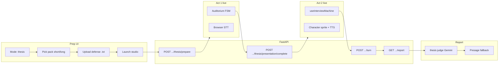

# SpeakUp — Thesis Defense mode (implementation plan)

**Goal:** Ship **Thesis Defense** as a two-act practice mode grounded in **one required defense file**. The user uploads a **`.txt` file** (v1: plain text only — abstract, outline, or short paper). That file **is** what they defend: act 1 is a **timed oral presentation of that material** (no teleprompter; they speak from the upload). Act 2 is **committee Q&A** where a **randomly assigned** character (recruiter / manager / HR — gender-matched TTS) asks **Gemini** questions using the **same file text** as context (`build_interviewer_context`). User can **end presentation early** and optionally **skip Q&A** entirely.

**Reference implementation:** Public Speaking is **done** — reuse its prep/live/report patterns (`SpeakingLive.tsx`, `use-speaking-session.ts`, `backend/speaking.py`, auditorium FSM). This plan does **not** re-specify speaking work.

**Runtime truth:** [handoff.md](handoff.md)  
**Presage / face pipeline:** `use-face-composure.ts` → `use-composure-sampler.ts` (same path as salary + speaking)

---

## Product summary

| Act | What the user does | Stage | AI / voice |
|-----|-------------------|-------|------------|
| **1 — Presentation** | Presents **the uploaded defense text** in their own words (timed; no teleprompter) | Auditorium backdrop; **no** opponent sprite; audience reacts to **face metrics only** (same FSM as speaking) | No interviewer dialogue; optional on-screen **filename + first ~300 chars preview** of the file (read-only) |
| **2 — Q&A** | Answers committee questions until Q&A timer ends | Office background for assigned character; opponent sprite + TTS | **Gemini** in `interviewer.py` with **`build_interviewer_context(session_id)`** = extracted **defense `.txt`** (same source as act 1) |

### Duration packs (user picks one in prep)

| Pack `id` | Presentation | Q&A | Total (if both run) |
|-----------|--------------|-----|---------------------|
| **`short`** | **30s** countdown | **60s** countdown | ~1.5 min |
| **`long`** | **60s** countdown | **120s** countdown | ~3 min |

Store in `settings_json` as `thesis_pack: "short" | "long"`, plus derived:

- `presentation_duration_sec`: 30 | 60  
- `qa_duration_sec`: 60 | 120  

Do **not** reuse speaking’s `30 | 45 | full` teleprompter modes.

### Early exit rules

| User action | When | Result |
|-------------|------|--------|
| **Finish presentation** | During act 1 (before timer) | Same as timer end for presentation scoring; **proceed to Q&A** unless user chose skip (below) |
| **Finish presentation & skip Q&A** | During act 1 | Persist presentation turn; set `skipped_qa: true`; **no** `/turn` loop; go straight to report |
| **End session early** | Any time (confirm dialog) | `ended_by: early_exit`; partial data in report; Q&A may be empty |
| Presentation timer **0:00** | Act 1 | Auto-stop STT → `POST .../thesis/presentation/complete` → act 2 unless `skip_qa` |

**Copy (prep + live):** Primary during presentation: **Finish presentation**. Secondary/destructive: **Skip Q&A — go to report** (only visible in act 1). During Q&A: **Submit answer** (salary pattern) + auto-close when Q&A timer hits zero.

### Committee member (random)

- At **`POST .../thesis/prepare`**, server picks uniformly from `{ recruiter, manager, hr }`.
- Persist `character_id` in `settings_json` (overwrite any client-sent value for thesis sessions).
- Client loads character from `GET /sessions/{id}` — **prep UI does not ask user to pick opponent**.
- TTS: existing `elevenLabsVoiceIdForCharacter` + `browserVoiceForCharacter` (gender map unchanged).

### Defense file (required — `.txt` only for v1)

The upload is not optional “background context” like salary prep — it **defines the defense**:

| Rule | Detail |
|------|--------|
| **Required** | Cannot **Enter studio** or call `thesis/prepare` without exactly **one** defense file on the session |
| **Format** | **`.txt` only** in thesis prep UI (`accept=".txt,text/plain"`). Reject PDF/DOCX at prepare with `thesis_requires_txt` even if global upload API still accepts other types for salary |
| **Content** | User-authored plain text: thesis abstract, chapter summary, claims + methods, etc. Demo copy: *“Upload the text you will defend — your talk and Q&A are about this file.”* |
| **Storage** | Same pipeline as today: `POST /sessions/{id}/documents` → `documents.py` extract → SQLite + `build_interviewer_context()` |
| **Canonical id** | On prepare, set `defense_document_id` (and `defense_filename`, `defense_text_preview`) in `settings_json` from the sole `.txt` row |
| **Validation** | After extract: `len(text.strip()) >= MIN_DEFENSE_CHARS` (suggest **80**); else `400` `thesis_defense_text_empty` |
| **Act 1 ↔ file** | Report/judge compares **presentation transcript** to **defense file text** (coverage, accuracy, omissions) — not a unrelated teleprompter |
| **Act 2 ↔ file** | Every Gemini/mock question must be answerable from the file; interviewer addendum: *questions probe claims, methods, limitations, and contributions **in the uploaded text*** |

Salary mode keeps PDF/DOCX/TXT on `ContextPanel`; thesis prep uses a **thesis-only** upload step (dedicated panel or `ContextPanel` with `accept` override + single-file UX).

---

## Success criteria (demo-ready)

1. **Prep:** Thesis Defense **unlocked** on Home/Prep (`modes.ts` `ready: true`).
2. **Defense file:** Cannot launch without one **`.txt`** upload; prepare fails on missing file, wrong type, or empty extract (all keys).
3. **Act 1:** 30s or 60s countdown; auditorium reactions; live user caption; **no** AI spoken lines.
4. **Transition:** On presentation complete, opponent **cuts in** (TTS optional one-line handoff from Gemini or static copy), background switches from auditorium → character office.
5. **Act 2:** Q&A runs **≤ configured seconds**; questions cite specifics from the **defense `.txt`** when `GEMINI_API_KEY` set.
6. **Skip Q&A:** Full path to Results with presentation-only rubric section.
7. **Report:** `/sessions/{id}/report` includes **thesis-specific rubric** (presentation + optional Q&A); `source: gemini` when keyed.
8. **Zero-key demo:** Mock committee questions seeded from **keywords in the defense text** (not generic interview bank); presentation scored with Presage heuristics + simple overlap vs. file text.

---

## Architecture overview



**Session model:**

| Phase | Turn storage | Notes |
|-------|--------------|-------|
| Presentation | **One** turn via `presentation/complete` | `question`: includes defense filename + short prompt e.g. `"Present your defense: {filename}"`; `answer`: presentation transcript; store `defense_document_id` on turn/settings; `decision.action`: `thesis_presentation_complete` |
| Q&A | **One turn per Q&A exchange** via existing `POST /turn` | Standard salary loop; director may `end_session` when Q&A timer expired (client stops submitting) |
| Skip Q&A | Presentation turn only | `settings.skipped_qa: true` |

Salary / interview paths unchanged. Speaking path unchanged.

---

## Phase 0 — Config & flags (0.25 day)

### 0.1 Frontend

- `frontend/src/config/modes.ts` — `thesis.ready: true` when implementation complete (keep `false` until Phase 7 QA pass).
- **New:** `frontend/src/config/thesis-duration.ts`

```ts
export type ThesisPackId = 'short' | 'long'

export const THESIS_PACK_OPTIONS = [
  { id: 'short', presentationSec: 30, qaSec: 60, label: '30s talk · 1 min Q&A' },
  { id: 'long', presentationSec: 60, qaSec: 120, label: '1 min talk · 2 min Q&A' },
] as const
```

- **New:** `frontend/src/lib/thesis-restore.ts` — mirror `speaking-restore.ts` to rebuild live state from `settings_json` after refresh.

### 0.2 Backend constants (`main.py` or `thesis.py`)

```python
THESIS_PACKS = {
    "short": {"presentation_duration_sec": 30, "qa_duration_sec": 60},
    "long": {"presentation_duration_sec": 60, "qa_duration_sec": 120},
}
ALLOWED_THESIS_PACKS = frozenset(THESIS_PACKS.keys())
COMMITTEE_CHARACTER_IDS = ("recruiter", "manager", "hr")
```

- Extend `POST /sessions` duration validation: when `scenario_id == "thesis"`, allow `session_duration_sec` in `{90, 180}` **or** omit and derive from pack at prepare (preferred: **only store pack on prepare**, presentation/qa secs in settings).

---

## Phase 1 — Backend module `thesis.py` (0.5 day)

**New file:** `backend/thesis.py`

| Function | Purpose |
|----------|---------|
| `pick_committee_character(session_id)` | `random.choice(COMMITTEE_CHARACTER_IDS)`; stable per session if already set |
| `validate_thesis_documents(session_id)` | Require **exactly one** `.txt` doc; extract length ≥ `MIN_DEFENSE_CHARS`; return `{ document_id, filename, text_len }` |
| `get_defense_text(session_id)` | Load full extract for judge (cap e.g. 12k for report prompt; interviewer still uses 8k via `build_interviewer_context`) |
| `mock_thesis_questions(session_id, n)` | Pull sentences/keywords from defense text; rotate defense-style prompts tied to that content |
| `gemini_handoff_line(session_id, presentation_excerpt)` | One short in-character sentence introducing Q&A (optional; fallback string) |
| `score_thesis_session(session_id)` | End report rubric (Phase 6) |

No Gemini teleprompter — presentation is free-form.

---

## Phase 2 — Prepare endpoint (0.5 day)

`POST /sessions/{session_id}/thesis/prepare`

Body: `{ "thesis_pack": "short" | "long" }`

Steps:

1. Session exists; `settings.scenario_id === "thesis"` (set on create).
2. `validate_thesis_documents` — fail if not exactly one `.txt` or text too short.
3. Set `thesis_pack`, `presentation_duration_sec`, `qa_duration_sec`.
4. Set `defense_document_id`, `defense_filename`, `defense_text_preview` (first ~300 chars).
5. `character_id = pick_committee_character(session_id)` — persist.
6. Set `thesis_phase: "presentation"` (client hint).
7. Return:

```json
{
  "thesis_pack": "short",
  "presentation_duration_sec": 30,
  "qa_duration_sec": 60,
  "character_id": "manager",
  "defense_document_id": "…",
  "defense_filename": "my-thesis-abstract.txt",
  "defense_text_preview": "We propose…"
}
```

Wire Pydantic models in `main.py`; add route next to speaking routes.

**Acceptance:** Two prepares on same session return **same** `character_id` (idempotent).

---

## Phase 3 — Presentation complete endpoint (1 day)

`POST /sessions/{session_id}/thesis/presentation/complete`

Body: mirror `SpeakingCompleteRequest` (transcript, elapsed_sec, finished_in_time, ended_by, samples, summary) plus:

```json
{ "skip_qa": false }
```

Server:

1. Validate thesis session; phase not already completed (`settings.presentation_completed_at` absent unless idempotent retry).
2. Append **presentation turn** (turn index = len(turns)+1):
   - `question`: `"Present your thesis (committee listening)"` (constant)
   - `answer`: transcript
   - `composure`: from summary or `sample_composure(transcript)`
   - `decision`: `{ "action": "thesis_presentation_complete", "skip_qa": bool, "ended_by": ... }`
   - `next_question`: if `skip_qa` → `{ "text": "", "end_session": true }`; else placeholder empty (first real question comes from `/turn` bootstrap — see Phase 4)
3. Merge `presentation_stats` (same shape as speaking `delivery_stats`) into settings.
4. Set `presentation_completed_at`, `skipped_qa`, `thesis_phase: "qa" | "done"`.
5. If `skip_qa`: clear report cache → return `{ ok: true, end_session: true, skip_qa: true }`.
6. Else: return `{ ok: true, end_session: false, skip_qa: false, committee_character_id, qa_duration_sec }`.

Client then starts Q&A segment (Phase 5).

---

## Phase 4 — Gemini interviewer branch (`interviewer.py`) (1–1.5 days)

### 4.1 Scenario addendum

**New constants:**

- `SCENARIO_THESIS_ADDENDUM` — committee defense tone: challenge methods, claims, limitations, contributions **from the defense file**; **must** anchor each question in uploaded text (quote or paraphrase a claim); no salary/compensation framing.
- `THESIS_FIRST_TURN_INPUT` — user just finished a timed presentation **of the defense file**; transcript may be attached; ask **one** sharp question **only answerable from the file**; spoken line ≤ 35 words.
- `THESIS_FOLLOWUP_SUFFIX` — Q&A time pressure; vary angle (methods, results, validity, limitations); never ask about content **not** in the file.

### 4.2 Persona tweak

In `_persona_instruction`, when `scenario_id == "thesis"`, append addendum **instead of** `SCENARIO_SALARY_ADDENDUM`. Characters keep existing voice/personality but **topic = thesis defense**, not compensation.

### 4.3 Mock path

Extend `_mock_question_bank` / `_mock_next_turn` for `scenario_id == "thesis"` using `mock_thesis_questions`.

### 4.4 Bootstrap first Q&A question

Two options (pick **A** for minimal frontend churn):

**A (recommended):** Client calls existing `POST /sessions/{id}/turn` with `{ "answer": "<presentation transcript or empty>" }` **once** after presentation complete to seed history, **or** dedicated `POST .../thesis/qa/start` that internally calls `next_turn` with synthetic history (presentation as prior answer).

**B:** `presentation/complete` response includes `first_question: { text, ... }` generated synchronously (duplicate seam).

Document choice in code comment; plan assumes **A** with `POST .../thesis/qa/start` thin wrapper:

`POST /sessions/{session_id}/thesis/qa/start` → builds history from presentation turn → `next_turn(...)` → sets `current_question` → returns `{ question, end_session: false }`.

### 4.5 Time-aware closing

When client posts turn with `{ "answer": "...", "qa_time_remaining_sec": 0 }` or session flag `qa_expired: true`, director/interviewer should return `end_session: true` with brief in-character closing (reuse `_mock_natural_closings` pattern / Gemini closing instruction).

---

## Phase 5 — Prep wizard (`StudioPrep.tsx` + `Setup.tsx`) (1 day)

When `modeId === 'thesis'`:

| Step | UI |
|------|-----|
| Scenario | Thesis Defense card enabled |
| Opponent | **Relabel** to **Duration** — two chips from `THESIS_PACK_OPTIONS` (not character grid) |
| Context | **Required** **`.txt` defense upload** (thesis-only accept); helper: *“This file is what you present and what the committee questions.”* Random committee note |
| Ready | Summary: pack label, **defense filename**, preview snippet, random committee |

**Session create:**

- `scenarioId: 'thesis'`
- `characterId`: **omit** on create (server assigns at prepare)
- `jobTitle`: e.g. `Thesis defense — {defense_filename}`

**Enter studio:**

1. `POST /sessions` + upload pending docs  
2. `POST .../thesis/prepare` with `thesis_pack`  
3. Navigate live with prepare payload + `character_id` for act 2  

**Acceptance:** Prep never shows recruiter/manager/HR picker for thesis.

---

## Phase 6 — Live UI (2–2.5 days)

### 6.1 Recommended structure

**New:** `ThesisLive.tsx` orchestrator  
**New:** `use-thesis-session.ts` — state machine:

```text
READY → PRESENTING → PRESENTATION_SUBMIT → QA_READY → QA_ACTIVE → SUBMITTING → DONE
```

Reuse:

- Act 1: clone `use-speaking-session` **without** teleprompter — extract shared `use-timed-delivery.ts` if duplication hurts, or parameterize `useSpeakingSession({ mode: 'thesis' })`.
- Act 1 UI: `SpeakingLive`-style auditorium via `useAudienceReaction` (`basePhase`: empty → house on start).
- Act 2: mount `useInterviewMachine` with `characterId` from prepare, **disable** `useComposureReactions` interject OR keep subtle (v1: **off** during Q&A to reduce noise).

### 6.2 Presentation panel

Replace teleprompter with **prompt card**:

- Title: “Present your defense”
- Sub: **`defense_filename`** + read-only **`defense_text_preview`** (scrollable optional)
- Helper: *“Summarize and defend the claims in your uploaded text.”*
- Timer: countdown from `presentation_duration_sec`
- Buttons:
  - **Start presentation** (READY → PRESENTING)
  - **Finish presentation** (complete act 1 → Q&A)
  - **Skip Q&A — go to report** → `presentation/complete` with `skip_qa: true`

### 6.3 Transition (character cuts in)

On successful presentation complete (not skip):

1. Stop auditorium FSM; switch `stageBackgroundUrl(mode, characterId)` to office map (already in `stage-backgrounds.ts` for thesis — today returns empty auditorium; **fix** to office during act 2).
2. Show opponent sprite + optional **handoff line** TTS:
   - Gemini `gemini_handoff_line` when keyed  
   - Else: `"Thank you. Let's move to questions about your work."`
3. Start **Q&A countdown** (`qa_duration_sec`) independent of presentation timer.
4. Call `POST .../thesis/qa/start` → play first question TTS.

### 6.4 Q&A timer behavior

- Footer shows **Q&A time remaining** (separate from old 3–15 min salary session timer — for thesis, **hide** global session duration or set `sessionDurationSec = presentation + qa` only for progress bar if desired).
- At Q&A **0:00**:
  - If `LISTENING`: auto-submit current transcript (salary `sessionTimeUpPending` pattern)
  - If `ASKING`: allow finish TTS then close
  - Set `qa_ended_by: 'timer'` in settings via final turn or `POST .../thesis/qa/complete` stub

**New optional:** `POST /sessions/{id}/thesis/qa/complete` — body `{ qa_elapsed_sec, ended_by }` — merges settings only, no new turn.

### 6.5 `StudioLive.tsx` extensions

Add prop `sessionPhase: 'presentation' | 'qa' | null` for thesis:

- `isSpeaking` false for thesis presentation but reuse `isThesisPresentation` for auditorium layout (camera rail optional — match speaking v1: docked camera during presentation).
- Show opponent only when `sessionPhase === 'qa'`.

---

## Phase 7 — End evaluation (`score_thesis_session`) (1 day)

Invoke from `_get_or_build_session_report` and `judge.py` when `scenario_id == 'thesis'`.

### 7.1 Gemini judge JSON (sketch)

```json
{
  "presentation": {
    "structure": 0.0-1.0,
    "clarity": 0.0-1.0,
    "confidence": 0.0-1.0,
    "presence": 0.0-1.0,
    "time_use": 0.0-1.0
  },
  "qa": {
    "depth": 0.0-1.0,
    "specificity": 0.0-1.0,
    "composure_under_pressure": 0.0-1.0,
    "overall": 0.0-1.0
  } | null,
  "overall": 0.0-1.0,
  "evidence": ["..."],
  "red_flags": ["..."],
  "skipped_qa": false,
  "committee_character_id": "hr"
}
```

**Inputs:**

- **Full defense `.txt` extract** (trimmed for prompt budget)
- Presentation transcript + `presentation_stats` → **`defense_coverage`** (did they hit main claims from the file?)
- All Q&A turns → **`qa_grounding`** (answers vs. file + questions asked)
- Flags: `skipped_qa`, `ended_by`, empty transcript, `defense_filename`

**Fallback:** Presage heuristics + token/keyword overlap: presentation vs. defense text; Q&A answers vs. defense text (mirror `presage_speaking_judge` structure).

### 7.2 Results UI

- `report-data.ts` / `Results.tsx`: thesis branch — show **Committee member** name from `character_id`; sections **Presentation** and **Q&A** (hide Q&A section if skipped).
- `transcript-feedback.ts`: add thesis catalog snippets.

---

## Phase 8 — QA matrix & tests (0.5 day)

| Case | Expected |
|------|----------|
| No `.txt` / empty file | Prepare fails `thesis_requires_txt` / `thesis_defense_text_empty`; Start blocked |
| PDF uploaded in thesis prep | UI rejects before upload; if bypassed, prepare returns `thesis_requires_txt` |
| No `GEMINI_API_KEY` | Mock Q&A + heuristic report; full demo path |
| No mic/camera | Block start (same as salary/speaking) |
| **Skip Q&A** | Report has presentation only; `skipped_qa: true` |
| Presentation timer expires silent | Empty transcript; `empty_presentation` red flag |
| Q&A timer expires mid-answer | Auto-submit or discard partial — document behavior; `qa_ended_by: timer` |
| Refresh mid-presentation | v1: **restart presentation** from settings (match speaking restart note) |
| Random character | Uniform over 3 ids; stable per session |

**Automated:** `backend/test_thesis_qa.py` — pack validation, mock questions, skip_qa report shape, character stickiness.

---

## File touch list (implementation order)

| Order | File | Change |
|-------|------|--------|
| 1 | `backend/thesis.py` | New module |
| 2 | `backend/main.py` | `/thesis/prepare`, `/thesis/presentation/complete`, `/thesis/qa/start`, optional `/thesis/qa/complete`; report branch |
| 3 | `backend/interviewer.py` | Thesis scenario prompts + mock bank |
| 4 | `backend/judge.py` | Delegate thesis to `score_thesis_session` |
| 5 | `frontend/src/config/thesis-duration.ts` | Pack options |
| 6 | `frontend/src/config/modes.ts` | `thesis.ready` |
| 7 | `frontend/src/config/stage-backgrounds.ts` | Thesis act 1 = auditorium; act 2 = office by character |
| 8 | `frontend/src/pages/StudioPrep.tsx` | Thesis prep steps |
| 9 | `frontend/src/pages/Setup.tsx` | Branch `ThesisLive`, session create/prepare |
| 10 | `frontend/src/pages/ThesisLive.tsx` | New orchestrator |
| 11 | `frontend/src/hooks/use-thesis-session.ts` | State machine |
| 12 | `frontend/src/lib/api.ts` + `api-types.ts` | Thesis API helpers |
| 13 | `frontend/src/lib/thesis-restore.ts` | Refresh recovery |
| 14 | `frontend/src/pages/Results.tsx` + `report-data.ts` | Thesis report UI |
| 15 | `handoff.md` | Unlock thesis in docs + API table (after ship) |

---

## Out of scope (v1)

- User-chosen committee member
- **PDF/DOCX defense uploads** (thesis mode is **TXT-only**; salary keeps mixed types)
- Multiple defense files (exactly one `.txt`)
- Multi-document synthesis beyond existing 8k interviewer / 12k judge caps
- Mock Interview mode
- Nemotron rubric per Q&A turn (keep salary director or static mock for thesis Q&A)
- Teleprompter / slide deck upload
- Audience spoken interjections during presentation (`POST /interject`)

---

## Open decisions (defaults chosen above)

1. **Character selection** → Server random at prepare; client displays name in act 2 only (spoiler-free optional: show “Committee member” until transition).
2. **First question** → `POST .../thesis/qa/start` wrapping `next_turn` (keeps one Gemini seam).
3. **Presentation turn question field** → Fixed string (not Gemini-generated).
4. **Background** → Auditorium act 1; office act 2 (update `stage-backgrounds.ts` thesis branch currently stuck on empty auditorium).
5. **Salary session timer** → Disable 3–15 min picker for thesis; only pack timers matter.

---

## Implementation sequence (suggested sprint)

1. Backend routes + thesis prompts + mock Q&A (Phases 1–4) — test with curl/httpx.  
2. Prep UI + session wiring (Phase 5).  
3. ThesisLive act 1 by copying SpeakingLive paths (Phase 6.1–6.2).  
4. Act 2 interview machine + Q&A timer (Phase 6.3–6.4).  
5. Report + Results (Phase 7) → enable `thesis.ready` → Phase 8 matrix. **Done** — see `handoff.md` Thesis QA matrix + `backend/test_thesis_qa.py`.

Runtime truth: **handoff.md** (not this plan).
